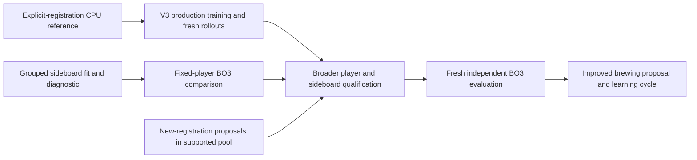

# Production integration toward learned brewing

September 12, 2026. Assigned worktree `E:/mtg-kernel-learned-sideboarding-codex`, branch `codex/learned-sideboarding-integration-v1`, starting head `919fd6510d8b82c23ed579b8c4672848eec26827`. Existing code and evidence remain intact. This is an integration sequence, not authorization for a production training or paid campaign.

**Primary end goal:** propose a supported registered 75, learn to play and sideboard it, then evaluate it against a diverse opponent population on fresh matches. A fixed list of deck classes or successful exchanges within an existing 75 is only part of that goal.

## What is already connected

Engineering-003 provides explicit supported 60/15 registrations, pre/postboard configurations, V6 observation / flat V3 revision-2 tensors, actor-visible trajectories, a native CPU Adam update and full checkpoint reload. Two natural games and one update establish an executable path. They do not establish playing competence or sustained throughput. Engineering-004 completed the standalone read-only evaluator and fixed fresh-head fit at source `0d02f27369a27484373806233ff3045804c4815f`: seed 2026091401, 100 epochs, learning rate 0.01, no value loss, the original 56 training examples and the final checkpoint only. The head SHA is `f7cd4bb24fd24fb17555a00b6a2e1ac0cd39dd5032a053584ffa8b5b58d8f76f`.

Fresh holdout configuration accuracy is 8/18, entirely the 8 Done-only examples; it matched 0/10 movement configurations, with legal outputs throughout. This fit did not reproduce any complete held-out teacher exchange. It also completed only 3/40 training movement plans, so the result does not isolate generalization failure or establish whether its exchanges are strategically useful. No different epoch/head was selected and no BO3 strength was measured.

Concrete [bound pilot preparation](E:/mtg-kernel-learned-sideboarding-evidence/engineering-004/bo3-prep-003/pilot-preparation.json) now supplies eight fully bound configs for the preserved 400-match engineering root, plus one exact first-match replay. The wrapper defaults to offline checks. An explicit later dispatch is serial BelowNormal CPU with a four-hour total cap, no GPU or paid resources, and native-closure checks. Preparation and hash/schema checks completed without running games. This pilot can establish coverage and completed-match cost; it cannot confirm playing strength or choose a replacement head from outcomes.

The old R0 ordinary-RL g2304 play export was trained on Rally/Rally. Its frozen weights and embedding rows load through an explicit feature transfer. The five-deck teaching games demonstrate paths that completed, not complete mechanic coverage or training exposure for every card. Catalog membership and an allocated embedding row are insufficient exposure evidence. Do not revive the older design's assumption that every active-catalog mainboard trained this particular checkpoint.

## Seams to reconcile in order

| Seam | Current source evidence | Next concrete integration |
| --- | --- | --- |
| Successor player in BO3 | `RunBatch` accepts `play_import` plus feature-transfer pins; `expanded_deck_training_v1` separately accepts a successor checkpoint | Share a strict read-only successor loader and add explicit BO3 checkpoint input. Preserve ancestry, actual parameter identity and feature pins. Keep old frozen-import behavior available as the matched reference. |
| Learned-head embedding compatibility | Learned checkpoints bind the frozen play identity and embedding-table hash | Refit or explicitly migrate the sideboard head when the play model or embeddings change. Do not relabel an incompatible checkpoint or relax its checks. Qualify the common play/head pair before comparison. |
| Production actor and deck scheduling | `native_trainer_v1.rs` uses `NativeFlatTensorizerV2`; its executor resolves `runtime_deck_by_id` | Add an explicit V3 successor actor path and schedule registration/configuration identities, learner seat and starting player. Keep actual behavior-state identity and fresh post-update collection. A label alone cannot identify a brewer's new 75. |
| GPU forward/backward | `train_step_feature_transfer_v3` uses one worker and `BackwardExecutionV1::Sequential`; the CUDA backend is a distinct existing path | Carry V3 feature identity through GPU inference, recomputation and gradients; compare real V3 forward/loss/backward/Adam against the CPU reference within a declared numerical envelope. Then measure completed decisions and updates per hour, including storage costs. |
| Store continuation | Expanded CPU checkpoints are a dedicated successor path; native Store V2 binds its existing contracts | Introduce explicit successor persistence with registration/configuration, feature, model/optimizer and trajectory identities. Warm-start from a verified export with declared optimizer initialization, or resume the exact successor format. Preserve legacy Stores and their rejection rules. |
| Model-guided search | Separate framework `ab09621e` / documentation `10741344` provides actor routing, reuse and adaptive credits; its hidden-zone audit covers Rally/Burn | Add reviewed V3 scoring and explicit selected-deck construction, then qualify search for the new mechanics. Audit hidden-zone sampling and belief invalidation across postboard/configuration changes. Caller-supplied belief tags currently identify context; they do not infer an archetype or define a posterior. |
| Arbitrary registered 75s in BO3 | CPU collection supports explicit registrations; learned BO3 currently constructs `checked_in_pauper_v1` decks | Extend the BO3 match initializer to validated explicit registrations. Keep registration identity separate from chosen game-2/game-3 configuration, with legal trace and full 75-card conservation. This is required for end-to-end brewing evaluation. |

Stage the successor loader and explicit-registration BO3 seam first, while keeping the already prepared fixed-player comparison unchanged. Next connect production collection, persistence and GPU computation. Qualify the resulting broader player before drawing strong conclusions from plans it evaluates. The native screen now passes, but confirmation remains unexecuted. Preserve that unchanged candidate for its registered confirmation before treating its advantage as confirmed. Any eventual search integration needs a new source/configuration identity and broader mechanics qualification. Search may change strength and cost, so include a common same-binary reference in a later matched experiment rather than attributing an integrated gain to sideboarding alone.

The native local assignment completed at `2026-09-12T21:08:17.521734+00:00`, with controller 16 reaped and no remaining native PIDs. Postprocess-002 reached `complete / awaiting_independent_result_review` at `21:09:38.891890+00:00`, with no child PID. All four cloud hosts were recovered and released; the guard-stopped receipt at `20:53:41.000575+00:00` records provider absence and stopped guard 51492. The retained network volume remains separate. Root owns the independent result interpretation. These are scheduling facts only, with no native-outcome-based fit selection.

Independent closeout review confirms the frozen native screen passed: adaptive allocation plus reuse gained 84/4096 strict wins in R0 and 85/4096 in R1, or +2.05 and +2.08 percentage points. The paired-root intervals are +1.05 to +3.05 and +1.00 to +3.17 points, with all registered count, lower-bound and opponent safeguards passing. All 32768 games completed naturally. This supports the unchanged candidate's separately registered confirmation, which has not run; it is not a broader-deck or equal-latency result. See [native result](C:/Users/Jack/IdeaProjects/cp7-search-distillation-20260910/runtime-integration-burst-001/RESULT.md). These outcomes did not change the sideboard fit, head or prepared controls.

The frozen native manifest remains `501c6f956717df55a6cbd841486b96f1c23b8822104f79e5deb26b95b70e0b75`; result SHA is `5bd87e584d92282e6da5a5f2c25518925abac4b1bf54d316871fe38c5ad53a58`. Preserve its source, binary, models, seeds, configurations, gates and confirmation reservation. No merge or new paid allocation occurred. Cloud closure cost is conservatively $14.04 for this burst, $54.71 cumulatively against $200, with retained storage separate. A released cloud allocation is not reusable sideboarding authority.

Local engineering retains `CARGO_TARGET_DIR=E:/cargo-target-learned-sideboarding`, `TEMP/TMP=E:/tmp/learned-sideboarding`, four build jobs and BelowNormal priority. Formal GPU work retains the project's exclusive headless GPU 1 convention and current compute priority. The prior cloud burst's cap does not authorize a new sideboarding allocation. Use one small manifest, freely retryable preflight, one exact end-to-end replay check, pinned measurement settings and appropriate paired controls. Do not recreate the retired incident protocol.

## Brewing work must advance alongside integration

1. Define a registration proposal over the currently supported non-token card pool, with exact 60/15 sizes and copy limits. Reuse the explicit-registration validators. Configuration search within a frozen 75 and proposals that change the 75 have different identities and must remain distinguishable.
2. Build a bounded proposal baseline, such as legal local substitutions from an existing registration, with deterministic candidate ordering, a fixed proposal budget and separate development/evaluation roots. Evaluate proposals against an explicit mixture of decks and historical checkpoints. Retain mirror regression coverage and matchup-level failures; one aggregate win rate can hide specialization.
3. Improve play competence on the relevant pre/postboard configurations. Keep deck diversity and opponent-policy diversity as separate axes. Historical self-play opponents can expose forgetting even when the deck mixture is unchanged; adding decks alone does not prove recursive improvement.
4. Learn a proposer only after its target and feedback are specified. A future sideboard RL path must connect decisions to terminal BO3 outcomes; current imitation examples have no value labels. A single teacher-match winner is not a causal sideboard-value label. Candidate-selection results require fresh independent confirmation before being used as strength evidence.
5. Track card exposure from actual consumed training records. Supported but weakly represented cards need exposure or an independently reviewed structural/text encoder. Engine support and useful learned card representation are separate requirements. A bounded brewer over known supported cards can begin before unrestricted unseen-card generalization is solved.

Success means stronger registrations and a player that can realize their strength, not more catalog entries or larger training-loss improvements. Report a coverage matrix, per-matchup BO3 effects with paired uncertainty, and compute cost alongside engineering status. Novel-registration, unseen-card, external-format legality and live MTGO claims each require their own evidence.

The three-group imitation holdout, absence of Burn/Rally holdout coverage, 24 Done-only examples, hand-authored teacher provenance and missing game-3 cells remain material limitations. Fresh Fable design/result attempts `7d54a2b3-e2fa-446b-8ef7-1fc47036386c` and `910caeba-1696-4138-90cd-f6cd75734857`, and native result attempt `6d8a2297-f1a6-45c5-a369-79dc1f4ad9ce`, failed weekly HTTP429 without source reads or substantive feedback. Independent Codex audits passed and the unavailable-review disposition is recorded; no Fable endorsement exists. Future consequential production, reward, sampling, search or measurement decisions still require appropriately scoped review.

Evidence: [engineering-003 result](learned_sideboarding_engineering_003_20260912.md), [CPU training workflow](expanded_deck_training_v1.md), [V3 revision](sideboard_chosen_creature_observation_v2.md), [dataset preparation](sideboard_dataset_preparation_v1.md), [BO3 preparation](learned_sideboard_bo3_comparison_v1.md), and [search handoff](C:/Users/Jack/IdeaProjects/search-framework-20260912/HANDOFF.md). Earlier September 9 plans are historical design context; their unfinished scope, exposure assumptions and W6 manifest are not current execution authority.
