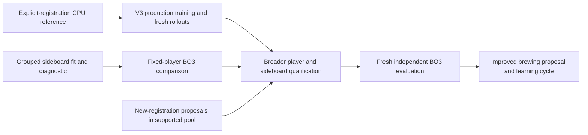

# Production integration toward learned brewing

September 12, 2026. Assigned worktree `E:/mtg-kernel-learned-sideboarding-codex`, branch `codex/learned-sideboarding-integration-v1`, starting head `919fd6510d8b82c23ed579b8c4672848eec26827`. Existing code and evidence remain intact. This is an integration sequence, not authorization for a production training or paid campaign.

**Primary end goal:** propose a supported registered 75, learn to play and sideboard it, then evaluate it against a diverse opponent population on fresh matches. A fixed list of deck classes or successful exchanges within an existing 75 is only part of that goal.

**Added near-term calibration goal, September 12:** compare agent matchup win rates with human matchup win rates, then compare aggregate deck rates under the same opponent-frequency weights. Align format, BO3 match outcome, rules/date window, deck variants and event population. Show human, agent and difference heatmaps with counts and uncertainty; leave unsupported cells visibly missing. Agreement would support matchup plausibility, but would not by itself demonstrate strong play. Use human rates as an external diagnostic, not a training target. Better play and successful brewing may eventually justify departures from the human baseline. A human dataset and numerical comparison gates have not yet been selected. See [evaluation note](E:/mtg-kernel-learned-sideboarding-evidence/evaluation-breadth-20260912/NOTE.md).

**Current engineering result:** Ward revision 3 at measured source `0f479bad488628840b8ec0b1c0e626926d692318` completed 400/400 matches and 927 games with zero unresolved matches in 262.3207898 seconds. All 25 ordered matchups completed in every arm, with both candidate seats and initial choosers; the extra first-match replay was byte-identical. This establishes pilot coverage and runtime, without head selection, playing-strength conclusions or production promotion. See [result](E:/mtg-kernel-learned-sideboarding-evidence/engineering-005/ward-successor-001/RESULT.md) and [Ward implementation](learned_sideboarding_engineering_005_20260912.md). Preserve the original engineering-004 interruption at 30/400 matches and 67 games as separate immutable evidence, along with all frozen fits and native results.

**Successor integration result:** strict checkpoint loading, actual parameter/embedding identity, explicit registered-75 BO3 and the CLI connection are compiled and verified at source `63de51911386f5fde7e8a40e4e1fc4016c619681`, with 53 focused checks passing. Two fresh revision-3 episodes supplied one CPU update. The reloaded player and a changed noncatalog 75 completed a two-game BO3 using keep policies, followed by byte-identical whole-match replay. Stale revision-2 checkpoint and old head inputs rejected before games. The new embedding table differs from the original and matches the installed checkpoint. These are separate [engineering-006 results](learned_sideboarding_engineering_006_20260912.md), not a change to the measured Ward binary or a strength claim. A fresh successor-bound head was also fit and evaluated under an explicit grouped representation-transfer receipt, then completed a two-game learned/keep BO3 while conserving the registered 75s. The known evaluation split remained 8/18 exact configurations and 0/10 movement plans; this functional check is not a sideboard-value comparison. The complete campaign remains active.

## What is already connected

Engineering-003 provides explicit supported 60/15 registrations, pre/postboard configurations, V6 observation / flat V3 revision-2 tensors, actor-visible trajectories, a native CPU Adam update and full checkpoint reload. Two natural games and one update establish an executable path. They do not establish playing competence or sustained throughput. Engineering-004 completed the standalone read-only evaluator and fixed fresh-head fit at source `0d02f27369a27484373806233ff3045804c4815f`: seed 2026091401, 100 epochs, learning rate 0.01, no value loss, the original 56 training examples and the final checkpoint only. The head SHA is `f7cd4bb24fd24fb17555a00b6a2e1ac0cd39dd5032a053584ffa8b5b58d8f76f`.

Fresh holdout configuration accuracy is 8/18, entirely the 8 Done-only examples; it matched 0/10 movement configurations, with legal outputs throughout. This fit did not reproduce any complete held-out teacher exchange. It also completed only 3/40 training movement plans, so the result does not isolate generalization failure or establish whether its exchanges are strategically useful. No different epoch/head was selected and no BO3 strength was measured.

The historical [engineering-004 preparation](E:/mtg-kernel-learned-sideboarding-evidence/engineering-004/bo3-prep-003/pilot-preparation.json) supplied the original eight bound batches. Its first execution stopped on Ward and remains unchanged. The separate Ward successor reused the same experimental settings and completed all 400 matches under a new binary/output identity. Its [summary](E:/mtg-kernel-learned-sideboarding-evidence/engineering-005/ward-successor-001/pilot-summary.json) records coverage, exact replay and cost; it does not rank heads. Both executions used bounded serial BelowNormal CPU work, without a paid allocation or GPU run.

The old R0 ordinary-RL g2304 play export was trained on Rally/Rally. Its frozen weights and embedding rows load through an explicit feature transfer. The five-deck teaching games demonstrate paths that completed, not complete mechanic coverage or training exposure for every card. Catalog membership and an allocated embedding row are insufficient exposure evidence. Do not revive the older design's assumption that every active-catalog mainboard trained this particular checkpoint.

## Seams to reconcile in order

| Seam | Current source evidence | Next concrete integration |
| --- | --- | --- |
| Successor player in BO3 | Source 63de5191 passed strict checkpoint/actual parameter/embedding reload and an executable changed-registration BO3 with exact replay; original ancestry remains separate | Use fresh revision-3 trajectories for broader learning and qualify playing strength. Historical revision-2 checkpoints remain rejected; keep frozen-import behavior as the matched reference. |
| Learned-head embedding compatibility | Source 63de5191 refreshes actual successor embeddings and rejects incompatible old heads; a newly bound head passed fitting, explicit grouped-example transfer, read-only evaluation and learned/keep BO3 execution | Improve the demonstrated limited teacher-plan fidelity and design terminal outcome comparisons for the compatible play/head package. Preserve original fits and keep inspected development diagnostics separate from fresh strength confirmation. |
| Production actor and deck scheduling | The original `native_trainer_v1.rs` remains V2/catalog-based. The separate engineering-007 CPU coordinator schedules explicit V3 registrations/configurations, learner seats and pinned per-seat opponents, and completed two actual updates with fresh collection | Extend this verified CPU path to broader training and evaluated population schedules, then connect the GPU backend. Keep actual behavior-state identity and fresh post-update collection. A label alone cannot identify a brewer's new 75. |
| GPU forward/backward | Engineering-009 compiles opt-in capture of actual device forward/backward loss and all 33 gradients; six host checks passed. A real 65-group CPU reference reproduces frozen full state exactly. No device arithmetic ran; actor collection remains CPU. | Complete numerical input coverage and the declared envelope, execute actual-device output/gradient/delta/moment comparison and continuation, then qualify GPU inference separately and measure complete decisions/updates per hour including storage. |
| Store continuation | Engineering-007 adds dedicated successor iteration/collection/update receipts with full model/Adam identity, a single-writer OS lock and validated prefix resume. Its simulated orphan-checkpoint recovery matched reference bytes | Qualify longer runs and any GPU-backed persistence against this CPU reference. This dedicated format is not legacy Store V2 migration or general filesystem durability proof. Preserve legacy Stores and their rejection rules. |
| Model-guided search | Separate framework `ab09621e` / documentation `10741344` provides actor routing, reuse and adaptive credits; its hidden-zone audit covers Rally/Burn | Add reviewed V3 scoring and explicit selected-deck construction, then qualify search for the new mechanics. Audit hidden-zone sampling and belief invalidation across postboard/configuration changes. Caller-supplied belief tags currently identify context; they do not infer an archetype or define a posterior. |
| Arbitrary registered 75s in BO3 | Source 63de5191 passed shared supported/non-token 60/15 and copy-limit validation; a changed Affinity registration completed BO3 against Elves with actual lists/hashes preserved and exact replay | Extend coverage to proposed registrations and compatible learned sideboarding. Preserve chosen configurations separately from registration identity; canonical static teachers may be used only with their exact bound registrations. |

The successor-loader, explicit-registration and compatible learned-head execution seams now pass their bounded engineering checks. Engineering-007 also verified dedicated CPU iteration/collection persistence, explicit population opponents and per-seat BO3, including the newly updated player and exact population/legacy replay. Preserve the completed fixed-player pilot and all separate successor verification outputs unchanged. Next qualify the GPU adapter and broader learning/evaluation design against this CPU reference. Qualify the resulting broader player before drawing strong conclusions from plans it evaluates. The native screen now passes, but confirmation remains unexecuted. Preserve that unchanged candidate for its registered confirmation before treating its advantage as confirmed. Any eventual search integration needs a new source/configuration identity and broader mechanics qualification. Search may change strength and cost, so include a common same-binary reference in a later matched experiment rather than attributing an integrated gain to sideboarding alone.

The native local assignment completed at `2026-09-12T21:08:17.521734+00:00`, with controller 16 reaped and no remaining native PIDs. Postprocess-002 reached `complete / awaiting_independent_result_review` at `21:09:38.891890+00:00`, with no child PID. All four cloud hosts were recovered and released; the guard-stopped receipt at `20:53:41.000575+00:00` records provider absence and stopped guard 51492. The retained network volume remains separate. Root owns the independent result interpretation. These are scheduling facts only, with no native-outcome-based fit selection.

Independent closeout review confirms the frozen native screen passed: adaptive allocation plus reuse gained 84/4096 strict wins in R0 and 85/4096 in R1, or +2.05 and +2.08 percentage points. The paired-root intervals are +1.05 to +3.05 and +1.00 to +3.17 points, with all registered count, lower-bound and opponent safeguards passing. All 32768 games completed naturally. This supports the unchanged candidate's separately registered confirmation, which has not run; it is not a broader-deck or equal-latency result. See [native result](C:/Users/Jack/IdeaProjects/cp7-search-distillation-20260910/runtime-integration-burst-001/RESULT.md). These outcomes did not change the sideboard fit, head or prepared controls.

The frozen native manifest remains `501c6f956717df55a6cbd841486b96f1c23b8822104f79e5deb26b95b70e0b75`; result SHA is `5bd87e584d92282e6da5a5f2c25518925abac4b1bf54d316871fe38c5ad53a58`. Preserve its source, binary, models, seeds, configurations, gates and confirmation reservation. No merge or new paid allocation occurred. Cloud closure cost is conservatively $14.04 for this burst, $54.71 cumulatively against $200, with retained storage separate. A released cloud allocation is not reusable sideboarding authority.

Local engineering retains `CARGO_TARGET_DIR=E:/cargo-target-learned-sideboarding`, `TEMP/TMP=E:/tmp/learned-sideboarding`, four build jobs and BelowNormal priority. Formal GPU work retains the project's exclusive headless GPU 1 convention and current compute priority. The prior cloud burst's cap does not authorize a new sideboarding allocation. Use one small manifest, freely retryable preflight, one exact end-to-end replay check, pinned measurement settings and appropriate paired controls. Do not recreate the retired incident protocol.

## Brewing work must advance alongside integration

1. Define a registration proposal over the currently supported non-token card pool, with exact 60/15 sizes and copy limits. Reuse the explicit-registration validators. Configuration search within a frozen 75 and proposals that change the 75 have different identities and must remain distinguishable.
2. Build a bounded proposal baseline, such as legal local substitutions from an existing registration, with deterministic candidate ordering, a fixed proposal budget and separate development/evaluation roots. Evaluate proposals against an explicit mixture of decks and historical checkpoints. Retain mirror regression coverage and matchup-level failures; one aggregate win rate can hide specialization.
3. Improve play competence on the relevant pre/postboard configurations. Keep deck diversity and opponent-policy diversity as separate axes. Historical self-play opponents can expose forgetting even when the deck mixture is unchanged; adding decks alone does not prove recursive improvement.
4. Learn a proposer only after its target and feedback are specified. A future sideboard RL path must connect decisions to terminal BO3 outcomes; current imitation examples have no value labels. A single teacher-match winner is not a causal sideboard-value label. Candidate-selection results require fresh independent confirmation before being used as strength evidence.
5. Track card exposure from actual consumed training records. Supported but weakly represented cards need exposure or an independently reviewed structural/text encoder. Engine support and useful learned card representation are separate requirements. A bounded brewer over known supported cards can begin before unrestricted unseen-card generalization is solved.

Success means stronger registrations and a player that can realize their strength, not more catalog entries or larger training-loss improvements. Report a coverage matrix, per-matchup BO3 effects with paired uncertainty, and compute cost alongside engineering status. Novel-registration, unseen-card, external-format legality and live MTGO claims each require their own evidence.

The three-group imitation holdout, absence of Burn/Rally holdout coverage, 24 Done-only examples, hand-authored teacher provenance and missing game-3 cells remain material limitations. Fresh Fable design/result attempts `7d54a2b3-e2fa-446b-8ef7-1fc47036386c` and `910caeba-1696-4138-90cd-f6cd75734857`, and native result attempt `6d8a2297-f1a6-45c5-a369-79dc1f4ad9ce`, failed weekly HTTP429 without source reads or substantive feedback. Independent Codex audits passed and the unavailable-review disposition is recorded; no Fable endorsement exists. Future consequential production, reward, sampling, search or measurement decisions still require appropriately scoped review.

Evidence: [engineering-003 result](learned_sideboarding_engineering_003_20260912.md), [CPU training workflow](expanded_deck_training_v1.md), [V3 revision](sideboard_chosen_creature_observation_v2.md), [dataset preparation](sideboard_dataset_preparation_v1.md), [BO3 preparation](learned_sideboard_bo3_comparison_v1.md), and [search handoff](C:/Users/Jack/IdeaProjects/search-framework-20260912/HANDOFF.md). Earlier September 9 plans are historical design context; their unfinished scope, exposure assumptions and W6 manifest are not current execution authority.
