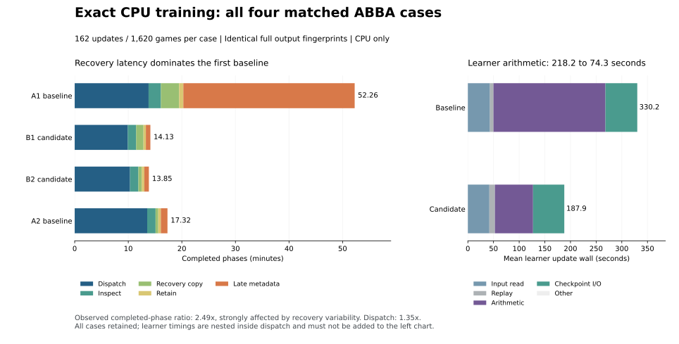

# Matched training throughput results

All four clean ABBA cases completed on 2026-10-10: **648 updates and 6,480 games**.
The candidate took **14.10 minutes per block versus 34.91 minutes baseline** in
full coordinator case wall time, an observed **2.475x speedup**. The declared
nonoverlapping completed-phase metric gives **2.487x**, or **59.79% less time**.
Both include durable recovery. These total ratios are strongly influenced by
the first baseline's 31.98-minute late metadata copy. They describe this
comparison, not a generalizable causal production gain.

The more consistent guarded-dispatch result is **1.350x**: 819.85 seconds
baseline versus 607.23 seconds candidate, **25.93% less time**. Adjacent paired
ratios are 1.391x and 1.311x. Native child time improved **1.515x**, from
591.08 to 390.12 seconds. These compare the combined code changes and each
variant's qualified worker count. They do not isolate individual patches.

## Every measured case

Each case completed the same 162 updates and 1,620 games. All values below are
seconds. Dispatch includes native execution, fingerprinting and archive work.
The five phase columns do not overlap; their sum is the completed-phase total.
Full case wall additionally includes controller/subprocess envelopes and small
metadata overhead. Native and learner timings below are nested diagnostics.

| Case | Dispatch | Inspect | Recovery copy | Retain | Late copy | Completed phases | Full case wall |
|---|---:|---:|---:|---:|---:|---:|---:|
| A1 baseline | 827.58 | 137.78 | 204.60 | 46.72 | 1,918.77 | 3,135.45 | 3,142.74 |
| B1 candidate | 595.07 | 93.14 | 81.85 | 27.03 | 50.58 | 847.66 | 854.40 |
| B2 candidate | 619.39 | 93.88 | 38.05 | 28.36 | 51.12 | 830.81 | 838.15 |
| A2 baseline | 812.12 | 93.48 | 30.43 | 28.73 | 74.29 | 1,039.06 | 1,046.63 |

Completed-phase pair ratios are **3.699x** and **1.251x**. All four observations
remain included. No outlier was discarded or replaced. The same late-copy
algorithm processed 1,188 files per case, and its extreme first-case latency
is not an implemented optimization. The two disk-wide diagnostic samples
recorded 196 and 256 ms mean E: write latency during A1; they cannot identify
whether filesystem, firmware, other I/O or another cause produced it.

The clean coordinator ran for **6,480.27 seconds (108.00 minutes)** from
13:50:07.652085 to 15:38:07.923749 UTC. Of that, 597.27 seconds were canonical
resource waiting outside case timers. Case walls sum to 5,881.92 seconds;
completed phases sum to 5,852.98 seconds. The 28.94-second difference includes
controller envelopes, the 0.875-second allocation audit and 0.189 seconds of
late-receipt self-copy. The remaining 1.075 seconds lies outside case walls
and recorded queue waits. Prequalification, initial launcher setup and prior
excluded attempts are outside this clean coordinator window. The complete
campaign's elapsed duration is not represented as a training speedup.

## Where the improvement occurred

Means are across the two cases per variant. Rows at different nesting levels
must not be added together.

| Timed region | Baseline seconds | Candidate seconds | Ratio | Timing scope |
|---|---:|---:|---:|---|
| Native child | 591.08 | 390.12 | 1.515x | Inside dispatch |
| Learner update wall | 330.15 | 187.94 | 1.757x | Inside native child |
| Learner arithmetic | 218.19 | 74.28 | 2.937x | Inside learner update |
| Checkpoint I/O | 62.06 | 60.92 | 1.019x | Inside learner update |
| Learner input read | 43.10 | 41.96 | 1.027x | Inside learner update |
| Behavior replay | 6.80 | 10.78 | 0.631x | Inside learner update |
| Collection execution | 123.33 | 109.95 | 1.122x | Inside native scheduler |
| Collection validation | 84.65 | 40.91 | 2.069x | Inside native scheduler |
| Archive wall | 86.84 | 81.43 | 1.066x | Inside dispatch |

The largest repeatable component reduction is learner arithmetic: about
143.90 seconds per block. Collection validation decreases by 43.74 seconds.
These are observed stage differences in a combined change; separate factorial
measurements were not run. Behavior replay became slower, so the implementation
does not improve every region. The native process used an average 1.58/1.63
CPU cores in the two baseline sampling windows and 1.42/1.41 in the candidate
windows, out of eight allowed cores. Candidate sampled peak RSS was
614/903 MB versus 1,489/944 MB baseline. These are process samples, not whole
host utilization or complete initialization/final-tail coverage.

## Biggest remaining opportunities

| Priority | Evidence in this run | Next bounded change to evaluate |
|---|---|---|
| Recovery latency and many small files | Identical late-copy operation took 50 to 1,919 seconds; 1,188 separate file creations/fsyncs per case | Bundle the same late inventory into one uncompressed archive, fsync once, then verify exact member paths, sizes and SHA-256s on the independent device. Preserve all contents and recovery guarantees. |
| Artifact scans and encoding | Candidate fingerprinting averages 129.31 seconds; archive wall another 81.43 seconds; exposure about 75.82 seconds | Reuse immutable parsed/validated data across compatible stages and avoid redundant scans, with explicit mutation detection and full recovery readback. Archive shard timings overlap and must not be summed. |
| Checkpoint and learner input I/O | Candidate spends 102.88 seconds here, 54.7% of learner update wall | Reduce repeated serialization, parsing and input materialization while retaining full Adam and durable checkpoint semantics. |
| Collection and remaining learner compute | Candidate collection execution 109.95 seconds and learner arithmetic 74.28 seconds | Profile the residual serial regions before changing worker counts or kernels. Keep synchronous batch order and exact numerical output checks. |

Checkpoint I/O plus input read takes **102.88 seconds candidate** (60.9152 +
41.9617), about **54.7% of its 187.94-second learner update wall**. This is the
next learner-side target: reduce repeated checkpoint serialization/parsing and
input materialization while preserving full Adam, durable publication and
continuation-loader readback. Candidate learner arithmetic is only 8.85% of
the complete-phase total; even eliminating it entirely would improve that
total by at most about 1.10x if all other time stayed fixed.

These follow-ups are recommendations, not measured additional speedups or new
experiment launches. CPU-only qualification chose eight collection/preparation
workers for baseline and four for candidate. Repeating an unqualified larger
worker count or moving this scalar workload to a GPU is not justified by the
observed idle CPU capacity alone.

## Validity, recovery and review

- All four full fingerprints match: ordered trajectories, full model/Adam
  checkpoints, update outputs and ledgers. Canonical fingerprint SHA-256:
  `e0f06e3ee762e715a3bbc0650470e4abf439865ff883e9781891078a05f36231`.
- Every observed native process used actual and expected affinity mask 21845,
  CPUs 0,2,4,6,8,10,12,14, through the supported timed guard. CPU-only runs use
  no GPU ordinal. The same frozen schedule, seeds and T1 checkpoint apply.
- Two-host serial/parallel qualification selected the desktop and per-variant
  worker counts. RunPod inventory returned HTTP403; no paid compute was started.
- Full archive member readback, independent D-to-E copies, fsync and SHA-256
  verification completed before retention/pruning. D and E were verified as
  separate physical devices. The terminal coordinator state has an exact E copy.
- V2 contention timing and V3 incorrect-affinity timing remain excluded and
  preserved. The initial v4 label-collision preflight performed no native work.
- Two read-only implementation reviews covered numerical operation order,
  gradient-buffer clearing, Adam, cache source pins, ordered collection,
  archive integrity and the synchronous allocation test at head
  `106a0db9a6e1010f3b09f39060dd893015d96f5b`. Neither found an actionable issue.
- A separate result review recomputed means, ratios and phase sums and checked
  small receipt hashes/bindings, affinity and four fingerprints. It reused the
  recorded full multi-GB recovery readbacks rather than rehashing them again.
  No arithmetic or binding issue was found.

This is two observed matched ABBA pairs. No confidence interval, isolated
patch causality, playing-strength improvement or holdout claim is made.

## Evidence and reproduction

`desktop/formal-v4-analysis.json` is an exact compact result copy, SHA-256
`c995e6357bffee601a8cf92f93e1614971433e3616cc493b1a50488b8db66ca6`.
Its pins bind the case manifest, raw summary, sealed plan, terminal state,
affinity receipts and excluded attempts. Bulk data stays outside Git under
`D:/training-speedups-20261009` with independent recovery under
`E:/training-speedups-20261009`.
All four original analysis files also have fsynced and SHA-verified copies in
`E:/training-speedups-20261009/formal-v4-analysis`, recorded by
`desktop/formal-v4-analysis-recovery.json` (receipt SHA-256
`4243f9bf853f1ed06297db0825712ae17204cd9973304a3afedcbcc2958d3c2c`).

The completed analyzer was
`D:/training-speedups-20261009/desktop/analyze_formal_clean_v4.py`, run with
pinned Python 3.13.14. It refuses partial results or overwriting an existing
analysis directory. Its historical generated text table omits a late-copy
header; numerical JSON is correct, and the repository copy of the summarizer
fixes that presentation defect. Frozen deployed sources remain unchanged.

`plot_results.py` regenerates the figure from the compact JSON using Matplotlib.
The figure is a visualization of completed receipts, not a new benchmark.
