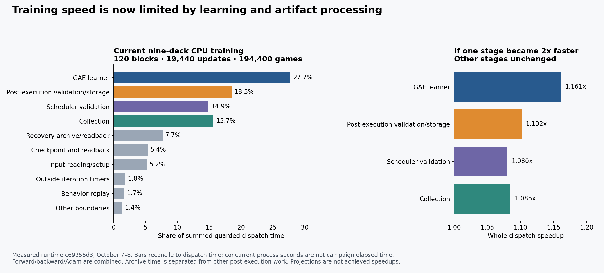

# End-to-end training throughput audit, 2026-10-09

The next speed work should target **the actual GAE learner and repeated artifact processing** for the current nine-deck CPU recipe. The older D3/search recipe has a different bottleneck: its slowest search game dominates each synchronous batch. A single throughput number or one universal optimization ranking would hide this distinction.

This audit recomputes completed-run timing receipts, checks current source and adopted optimizations, and inventories both PCs and RunPod. No training, simulation, evaluation, build, paid allocation or changes to active jobs were performed. The active reservations prevented a fresh matched timing run. These are measured historical runtime profiles and a current source audit, not measurements of a newly built main executable and not playing-strength evidence.

## Evidence and accounting

| Workload | Measured runtime | Coverage | Role |
| --- | --- | --- | --- |
| Nine-deck baseline, October 7-8 | `c69255d32e8cfa46974ff8c93cd9ce7b4f0a366d`, binary `c1b4406c9d09f1c7c315ffc7cfa15ac847f11fba35f005ee0d0bba709ee9ebf2` | Six completed runs, 20 blocks each, 162 updates/block, ten games/update | Current primary training workload; CPU sequential GAE learner |
| Line A public-feature/D3 screen, October 1-2 | `cea04ba9`, binary `c5a833ab9c9b896ac8bae346663854b5dcd4e7e534a5ae26aab597d7b4e4f081` | Four completed 200-update runs: 400 treatment and 400 control updates | Search-heavy contrast; CPU collection with CUDA learner |
| Current code audit | `e0ea59c01e861a6fc699fbfe9e51643c0650f797` | Native expanded, public CUDA, campaign/dispatch/storage layers | Adoption check and implementation locations |

All stage percentages use sums of seconds, not averages of percentages. Concurrent process seconds are explicitly separated from elapsed fleet/campaign wall time. Inner update timers partition the update stage and must not be added to their enclosing scheduler stage. Collector busy seconds are worker wall occupancy, not CPU utilization. CUDA call timers are host wall scopes, not GPU kernel times. File sizes below are cumulative logical output/archive volume, not physical I/O traffic or peak retained storage.

Primary inputs are explicit campaign roots, small update/collection receipts, scheduler stdout, dispatch/execution reports and completed-run state. The analysis projects timing/count/hash fields and never opens trajectories, checkpoints, exposure results, evaluation outcome files or holdout panels. Source hashes and input rollups accompany the derived profiles. The source runtime's pinned full optimizer and trajectory parity receipts are reused; this audit does not regenerate training outputs.

## Current native-expanded pipeline

```text
campaign reservation and declared cores
  -> checked allocation, runtime and storage admission
  -> load initial checkpoint and validate completed prefix
  -> repeat synchronous update:
       private CPU collectors -> publish trajectories -> join in schedule order
       validate collection
       read model/trajectory inputs -> parallel behavior replay
       sequential GAE forward tapes -> backward -> Adam
       snapshot/checkpoint -> real continuation-loader readback
       validate collection again -> validate update -> publish completion
  -> Python output fingerprint of every trajectory/checkpoint
  -> two-shard level-1 recovery archive and full checksum readback
  -> exposure collection, retained-copy verification and pruning
  -> next block, then development evaluation and analysis
```

The last campaign maintenance stages and development evaluation are outside `report.seconds`; native startup/prefix validation is outside per-iteration timers. `execution.seconds` starts before preflight, not exactly at process creation. The difference between dispatch and execution is a measured combined fingerprint/storage/recovery bucket, not a pure compression timer.

## Completed nine-deck measurements

The audit covers **all 120 completed blocks, 19,440 updates and 194,400 games**, including 17.05 million learner policy substeps. It reconciles **117,318.723 summed guarded dispatch seconds**: 86,525.710 seconds through native execution and 30,793.013 seconds afterward. Desktop supplies 57 blocks; Haley supplies 63. Detailed r1 receipts were moved from Haley to E: and were read from their recorded retained location, not treated as missing work. Every retained update used here matches its iteration-completion hash.



| Exclusive part of complete dispatch time | Seconds | Share | Whole-dispatch gain if this part becomes 2x faster |
| --- | ---: | ---: | ---: |
| GAE learner forward/backward/Adam | 32,551.277 | 27.75% | 1.161x |
| Post-execution fingerprint/storage checks, excluding archive | 21,733.026 | 18.52% | 1.102x |
| Collection, including initialization and trajectory publication | 18,386.209 | 15.67% | 1.085x |
| Scheduler collection/update validation | 17,463.636 | 14.89% | 1.080x |
| Recovery archive creation and full readback | 9,059.987 | 7.72% | 1.040x |
| Checkpoint construction/publication/readback | 6,322.034 | 5.39% | 1.028x |
| Update input reads/model setup | 6,153.774 | 5.25% | 1.027x |
| Execution outside timed iterations | 2,108.968 | 1.80% | 1.009x |
| Behavior replay | 1,937.975 | 1.65% | 1.008x |
| Scheduler/update boundary and small remaining work | 1,601.836 | 1.37% | 1.007x |

Artifact validation, fingerprint/recovery, input reading and checkpoint/readback together occupy **51.77%** of dispatch time. That is a broad work category, not disk wait: it includes CPU JSON parsing, hashing, encoding and repeated model setup. Halving all of it would give a conditional 1.349x dispatch speedup. Halving learner computation alone gives 1.161x. These bounds make repeated artifact processing at least as important to investigate as learner kernels.

| Host and executed allocation | Completed blocks | Mean native iteration | Mean complete dispatch cost/update |
| --- | ---: | ---: | ---: |
| Desktop, 8 collectors/preparation workers, logical CPUs 0-15 | 57 | 3.210 s | 4.384 s |
| Haley, 4 collectors/preparation workers, varying declared CPU sets | 63 | 5.367 s | 7.528 s |

These are observed workloads/placements, not a matched host benchmark: run seeds, concurrency and core allocations differ. The weighted full-recipe mean is 4.342 seconds inside the iteration and 6.035 seconds through dispatch.

The desktop mean iteration is 3.210 seconds, median 2.966, p90 4.400 and maximum 13.494. The sum of iteration times is 29,636.974 seconds; these include overlapping runs. Their successful-attempt interval union is 18,111.372 seconds and first-to-last envelope is 18,648.292 seconds. Neither measure includes all post-dispatch campaign maintenance, the earlier computehost blocks, or development evaluation. Do not divide the whole campaign's games by this desktop interval.

The desktop blocks cumulatively generated 531.894 GB of logical native output and 184.602 GB of compressed recovery archives. They were subsequently pruned according to the campaign's retention policy. This is generated artifact volume, not present disk usage or measured physical I/O traffic. Repeated hashing/parsing/archive/readback passes add work beyond these sizes; their actual disk traffic was not measured. Increasing game simulation speed without addressing artifact processing will expose more of that cost.

Across both hosts, cumulative logical native output is **1.124 TB**, and compressed archive output **334.430 GB**, about 57.83 MB and 17.20 MB per update respectively. All 120 archive metadata records were recovered and checked against their report pins. They separate **9,059.987 seconds of archive creation/full readback** from **21,733.026 seconds of other post-execution work**. Archive is 7.72% of total dispatch, while other final verification/storage work is 18.52%. Calling the whole post-execution bucket compression or prescribing a faster codec would miss most of it.

Recorded first training dispatch was October 7 at 12:48:56 EDT; the last completed training state was October 8 at 13:21:57 EDT: **24.550 hours**, about **2.20 completed scheduled games/second across the calendar envelope**. This includes host scheduling, interruptions and campaign maintenance. It excludes earlier qualification and later evaluation. Summed dispatch time is 32.589 process-hours because runs overlap. Per-run first-dispatch-to-complete-state envelopes are r1 7.423 h, r2 7.537 h, r3 8.284 h, r4 8.432 h, r5 5.214 h and r6 4.398 h. The r4 storage interruption/move and r5 dispatch refusal remain in those envelopes; successful-block stage shares omit their failed work. These gaps are operational opportunities, not proof that all idle time was removable or available to this lane.

Current matched one-update qualification on desktop CPUs0-15 took **7.43/5.75/5.34/5.26 seconds at 1/2/4/8 workers**. Moving from four to eight gave only about 1.4% improvement in that short trial. Haley whole-host qualification took 10.38/8.70/8.47/8.73 seconds. These are initial single-update comparisons including startup and recovery, not steady-state rates. Complete block means above are a better denominator for planning sustained work. Different core sets and concurrent replicas require their own comparison.

Across all 9,234 desktop collections, initialization consumes **23.86%** of collection time. Worker busy wall divided by available worker wall after initialization is **62.70%**; the busiest worker occupies **97.52%** of that window. This identifies real straggler and initialization costs without calling idle worker wall CPU utilization. It also argues against simply increasing collectors beyond eight. Native prepared replay is already parallel and occupies only 1.65% of full dispatch time across both hosts.

The GAE timer includes independent forward recomputation, reverse passes, Adam and associated finalization. There is no recorded phase split in this specific GAE route, so this audit cannot honestly call all of it backward or GPU-suitable work. The older opt-in phase recorder is wired through a different training entry point.

## Search-heavy contrast, completed October 1-2 screen

Recomputing all 800 receipts replaces the October 1 partial 449-update snapshot. Every run covers updates 0-199 with a contiguous optimizer chain. Across 400 treatment updates, 34,497.113 summed process seconds divide into **94.98% collection/join**, **2.92% learner device calls**, **0.96% trajectory publication**, **0.66% replay/targets**, and 0.48% other work. Treatment mean is 86.243 seconds; p90 174.436; maximum 312.685. The slowest 10% of updates consume 25.91% of treatment update time. Controls instead spend 39.07% collecting and 30.75% in device calls.

Ten segment-first learner calls total 643.254 seconds, versus 365.022 seconds for the remaining 390 calls. Eliminating all segment-first calls could remove at most 1.86% of treatment update time. Eliminating every learner call has only a 2.92% ceiling for this workload. This conclusion cannot be transferred to the newer CPU baseline.

The historical two-update collector sweep was 221.0/118.4/119.8/124.2 seconds at 1/4/8/16 workers with identical optimizer chains. In a separate retained diagnostic, the critical game consumed 98.61% of the batch's collection span and 99.14% of its own time in search; effective concurrent game-worker occupancy was about 2.18 despite eight configured workers. This establishes a search tail, not a reason to change adaptive search scheduling without qualifying behavior.

The completed launcher phases total **5.095 hours**, but an actual compression-lag failure held all four runs at update 160. Recovery and continuation completed them. Reservation acquisition to the last recorded final-compression artifact spans **10.680 hours**, including the hold and recovery; it is an artifact envelope, not uninterrupted execution or an exact launcher-exit timer. The earlier snapshot's low storage averages missed this operational failure. Recovery preserved all recorded segment hashes.

The old 876.9 versus 2,053.9 second matched-prefix production gap remains a historical unexplained environment/process gap, not an available 2.34x patch. Haley Q006's separate four-update ABBA process-policy comparison gave concurrent paired speedups 1.129x and 1.245x, but inconsistent serial gains. It is insufficient evidence for a full-run or current-runtime speedup.

## What has already been optimized

PR155 is an ancestor of the measured nine-deck runtime. It adopted transposed inference weights, shared scorer state work, multibuffer state hashing/prefix reuse and streamed V3/V4 observations. Current source also parallelizes public trajectory publication/replay, native behavior preparation and native scheduler collection validation. Recommending these as absent work would repeat obsolete conclusions. PR155's reported 2.6x rollout-search pilot improvement is not a measured whole-training gain.

The current GAE CPU trainer uses its own forward/backward implementation. Inference optimizations in `native_policy_value_net_v1.rs` do not automatically optimize its scalar training loops. Likewise, a merged CUDA backend is not an admitted native-expanded CUDA launch: the current supported dispatcher and nine-deck campaign still require CPU.

## Ranked speedup work

These are measured component ceilings and proposed interventions, not promised gains. For an exclusive dispatch fraction `f`, a 2x component improvement yields end-to-end speedup `1/(1-f/2)`. Eliminating a stage is a mathematical bound, never an implementation plan. Queueing, maintenance, recovery and downstream evaluation further dilute savings.

| Priority | Work | Why it ranks here | Qualification needed |
| --- | --- | --- | --- |
| 1 | Split and optimize the actual GAE learner | Largest named compute stage. Add forward, backward, Adam and finalization timing in `native_policy_train_step_v1/gae_v1.rs`; inspect scalar training matrix loops. Ordered independent forward-tape construction and order-preserving SIMD are exact-output candidates. | Matched full-batch seeds, trajectory and full Adam/parameter bits; disabled/profiled overhead comparison; completed guarded block time. Do not assume backward is the entire timer. |
| 2 | Remove repeated parsing/encoding and avoid redundant verification work within one trusted invocation | Scheduler validation plus checkpoint/input work is substantial; final fingerprints revisit every trajectory and checkpoint before archives reread them. | Stream hash plus parse, reuse validated immutable state, and carry identical evidence forward. Preserve corruption rejection, crash-consistent publication, recovery verification and final hashes. Measure the full block including maintenance. |
| 3 | Reduce recovery/retention traffic and overlap independent maintenance when measured useful | Verified archive/readback is 7.72% of dispatch and logical native output averages about 9 GB per desktop block. Other final verification/storage work is larger at 18.52%, so prioritize that before codec changes. | Bound queue/backpressure and peak bytes; keep recovery durability and failed attempts. Compare actual end-to-end throughput, not compressed MB/s alone. |
| 4 | Qualify CPU parallel or CUDA learning as a distinct backend if exact improvements are insufficient | Existing fixed-four and CUDA routes could attack learner compute but are not bit-identical drop-ins. | Existing `fixed_partition_4` changes f32 reduction association. CUDA has a different numerical identity, requires native dispatcher support and workload qualification. Do not alter a frozen baseline. |
| 5 | Reduce collector stragglers, repeated opponent loads and shared-cache contention | Collection remains meaningful but is a minority in the current baseline. More workers alone show diminishing returns. These are the first priority for the historical D3 recipe. | Per-episode/load/inference/search timing, worker wall occupancy, cache hit/wait telemetry, then identical-output serial/parallel comparison. Do not change seeds, search budget or adaptive tree semantics as an engineering speedup. |
| 6 | Improve pipeline placement and failure recovery | The historical compression stop and current host scheduling show why complete-result latency exceeds trainer speed. Independent runs can span both PCs when qualified. | Preserve reservations; compare full blocks including transfer, startup, validation, storage, recovery and available memory. Hardware occupancy alone is not useful throughput. |

Useful source locations at audited main:

- `mtg-kernel/src/native_policy_train_step_v1/gae_v1.rs:371`: serial forward tapes; reverse work follows at 474. Training matrix routines: `native_policy_train_step_v1.rs:4026`.
- `mtg-kernel/src/native_policy_train_step_v1.rs:16`: fixed-four numerical contract; `:2306` deterministic partition reduction.
- `mtg-kernel/src/native_expanded_training_run_v1.rs:513`: parallel hash then parse; `:799` prefix validation; `:988` and `:1012` repeated new-iteration collection validation; `:1049` timing scope.
- `mtg-kernel/src/expanded_deck_training_v1.rs:2636`: update scope; `:2946` learner; `:3256` checkpoint/readback; `:3404` exposed timing fields.
- `mtg-kernel/src/expanded_deck_training_v1/phase1_parallel_collection.rs:195`: collection and trajectory publication; `:285` worker timing.
- `python/tools/native_expanded_dispatch_v1.py:342`: trajectory fingerprint; `:371` all-update checkpoint fingerprint; `:587` dispatch clock; `:650` archive.
- `python/tools/public_training_storage_v1.py:24`: archive reads, two shards, fsync and checksum readback.
- `mtg-kernel/src/native_flat_tensorizer_v2.rs:359`: process-wide prefix-cache mutex; contention is currently a hypothesis.

## Resource availability and launch coverage

At October 9 approximately 17:04 EDT, Jack's PC had a 13700K, 24 logical CPUs, about 128 GiB RAM, RTX4070 SUPER 12 GB and RTX3050 6 GB. D: SSD had about 304 GiB free; E: HDD about 688 GiB. Canonical reservation generation 411 belonged to `claude-stage4a-20261009`, with formal work on declared cores. Haley had a Ryzen3700X, 16 logical CPUs, 31.93 GiB RAM with 10.47 GiB available, RTX4060 8 GB and 68.99 GiB free on C:. Reservation generation153 belonged to `spellbench-learned-backlog`. Both live claims were preserved. Haley had only about 8.99 GiB above the 60 GiB reserve, so a repeat block also needs a measured storage projection.

Read-only RunPod inventory found five exited pods and no active pod. No new paid allocation is authorized by a general performance audit, and no cloud training throughput was measured. An eligible future cloud comparison must include Linux runtime/library identity, transfer/recovery and a bounded lease, not just GPU specifications.

Current supported training paths include the public qualified dispatcher and `native_expanded_dispatch_v1.py` (including the nine-deck campaign). Native training qualification runs one complete synchronous update, capped at 32 games, then the production path requires compatible serial/parallel receipts, current three-host inventory, runtime/workload binding, storage limits and a canonical reservation. The latter path admits CPU only. The historical Line A training run used a separately pinned launcher in `D:/mtg-kernel-lead-run` (initial dispatch `042791b7`, later continuation receipts bind their own revision). The repository's current `g115_line_a_windows_launch_v1.py:38` does not admit screen training, so that historical path must not be mistaken for migrated main-branch training support. Raw Rust binaries and the older Python `training_benchmark.py` are not substitutes for the production placement guard.

## Remaining measurement gaps and the next comparison

The next free reservation should compare the pinned completed baseline against **one change at a time** using the supported native-expanded qualification entry. Use identical schedules, initial full Adam state and unchanged loss, both a representative short qualification and one complete 162-update block; measure child completion, fingerprint, archive, exposure, retention and controller envelope separately. Compare one worker then increasing useful counts, with preparation workers reported separately. Reuse compatible baseline evidence where source and conditions match.

Instrument only the unresolved GAE forward/backward/Adam split and fingerprint versus storage-validation spans first; archive timing is already recoverable separately. Add per-game collector timings when selecting a collection intervention. Use thread-local counters and check profiler overhead; the existing optional prefix diagnostic adds its own global mutex, comparisons and copies. Current telemetry is coarse process CPU/RSS and cannot identify CPU cycles, cache misses, lock wait, disk latency or CUDA kernel time.

The full current-main fresh profile, controlled causal comparisons, actual candidate speedups, and post-training evaluation speedups remain unmeasured. The report identifies and bounds the biggest measured opportunities without claiming those follow-on results.

## Reproduction and verification

The committed timing projections are sufficient to recompute the complete attribution and chart without SSH or training:

```text
python -B docs/reports/training_throughput_20261009/summarize.py
```

`summary.json` binds its input files by SHA-256 and checks exactly six runs, 20 distinct blocks/run, 19,440 updates and 194,400 games, with exclusive nonnegative stages reconciling to dispatch time. The desktop source extractor additionally verifies every selected report against completed-run state, every retained update against its completion pin, scheduler index completeness and inner/outer timer containment. Remote detailed extraction checks completion/update/collection metadata against the retained-file manifest. Archive receipts on both hosts were checked against dispatch report pins. Failures and moved evidence are explicit; missing files are not zero timings.

To repeat the source extraction on the same retained roots:

```text
python -B docs/reports/training_throughput_20261009/profile.py --hot D:/nine-deck-baseline-20261007/campaign/hot --retained E:/nine-deck-baseline-20261007/campaign/retained --state D:/nine-deck-baseline-20261007/campaign/state/runs --runs r4 r5 r6 --output docs/reports/training_throughput_20261009/desktop-profile.json
python -B docs/reports/training_throughput_20261009/aggregate_local_r1.py
python -B docs/reports/training_throughput_20261009/aggregate_native_collection.py
python -B docs/reports/training_throughput_20261009/aggregate_historical.py
```

The `remote_metadata.py`, `remote_breakdown.py` and `remote_archive_timing.py` helpers are bounded read-only SSH extractors. Supply the existing verified SSH target as `MTG_AUDIT_SSH_TARGET` and its installed Python path as `MTG_AUDIT_REMOTE_PYTHON`. They do not disable host verification or launch native work. `capture_context.py` projects the saved inventory/state metadata from this audit's explicit local scratch directory; it is not a live machine poll. Its committed `context.json` retains the small sanitized projection, source hashes, archive times, qualifications and calendar boundaries.

Validation performed: complete metadata coverage, source-pin checks, stage reconciliation, summary/PNG regeneration, Python syntax checks, visual inspection and `git diff --check`. A separate read-only source/accounting review corrected artifact-volume versus I/O terminology, current Line A launcher coverage, and retained-attempt binding. No Rust code changed, so no native build or training test was needed. See `manifest.json` for the audited source, runtime/toolchain boundary and derived-file hashes.
