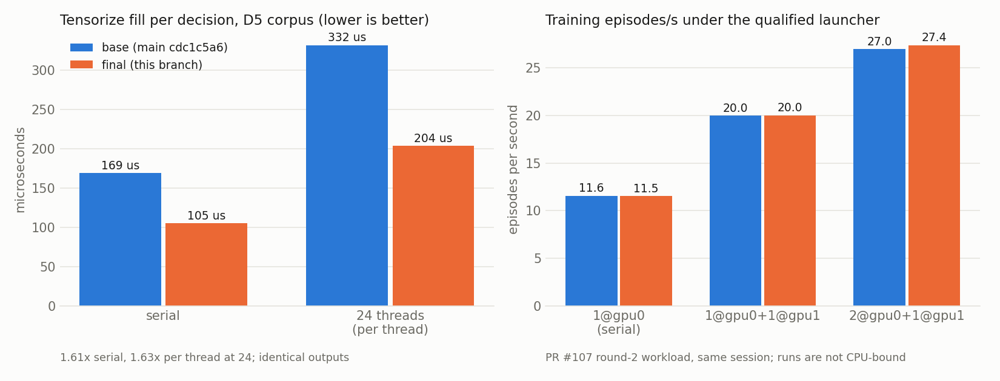

# Tensorize per-decision CPU cost, byte-identical (v1)

Status: branch `opus/tensorize-cost-v1`, engineering only. Goal text:
`collab/GOALS/opus-tensorize-cost-20260923.md`. Design review queued in
`collab/FABLE-QUEUE.md` ("Opus lane 2").

**Result: 1.6x on the per-decision tensorize cost, not the 2x target.**
Every digest byte, tensor row and training output is identical. The
remaining cost is almost all SHA-512 over bytes that must be hashed
unchanged, and this CPU (no AVX-512) offers no faster exact way to hash
them.

## Where the cost was

`NativeFlatTensorizerV2::fill` builds the thirteen model tensors for one
decision. The state tail and every action row end in 96 digest features: six
SHA-512 digests of `namespace || counter_le32 || canonical_json`, counters 0
to 5. The state JSON averages 21.5 KB on the D5 corpus and about 40 KB in
live training, and it was hashed in full six times per decision.

Base, D5 corpus (10,051 decisions), serial:

| fill | state SHA-512 | action SHA-512 | serialize | other |
| --- | --- | --- | --- | --- |
| 184 us | 153 us | 8 us | 12 us | 11 us |

That breakdown comes from a first session; the host's speed drifts about
10 percent between sessions, so the before/after ratios below use base and
final binaries alternated in one session (base 169 us there). Receipts:
`docs/reports/tensorize_cost_v1/base/`.

## What changed

All changes are exact by construction. What is serialized, the hash, the
namespaces, the counters and the block-to-feature mapping are untouched.

1. **One hashing call per decision.** `fill` is split into three steps:
   - prepare: JSON writes and the non-digest tensors;
   - hash: all 6 + 6n messages in one call;
   - finish: digest features and the existing output checks.
2. **Multi-buffer SHA-512** (`mtg-kernel/src/sha512_multi_v1.rs`): four
   messages share one AVX2 compression, one per 64-bit lane.
   - Longest job first, and a lane takes the next job as soon as its own
     finishes.
   - The last one or two jobs finish through `sha2::compress512` (the same
     compression `Sha512` uses; the `compress` feature only exports it).
   - Without AVX2 the `sha2` crate runs as before.
3. **State prefix cache.** SHA-512 is Merkle-Damgard: the chaining state after
   block k depends only on the first k+1 blocks. A process-wide cache holds
   the six chaining states at every eighth data-only block of the last 64
   state JSONs.
   - A new JSON resumes from the deepest checkpoint inside its common prefix
     with a cached JSON, confirmed by a full byte comparison (never a hash)
     and within its own data-only blocks.
   - The cache changes cost, never output.
     `MTG_KERNEL_TENSORIZE_STATE_CACHE=0` disables it.
4. An off-by-default `tensorize-cost-profile-v1` feature counts fill, packet
   encode and pooled-forward time in the multirun pilot. Production builds
   carry no counters.

Measured and not kept:
- interleaving two scalar lanes into the AVX2 loop (1.2x vs 1.4x);
- a byte-shuffle rotate;
- a schedule-first unrolled compression (both slower);
- checkpoints every 4 blocks (no change);
- tensorizing each forward-pool task's decisions together: `fill` 261 to 244
  us live, no episode-rate change, and it added a path to the pool's failure
  handling.

## Identity evidence

Goldens were written from unmodified tensorizer code. Each decision's
fingerprint covers:
- all thirteen tensors, as bit patterns;
- the state canonical JSON;
- every action's canonical JSON and SHA-512 blocks.

Test sources are in `native_flat_tensorizer_v2_cost_tests_v1.rs`; receipts
are `docs/reports/tensorize_cost_v1/after/identity-final-release.txt`.

| Check | Result on the final release binary |
| --- | --- |
| D5 corpus golden, 10,051 decisions (rollup `7a684426`) | identical |
| Search-wrapped matches golden: 8 matches, T512, real forward, both seats; 1,114 root decisions, 575/539 by seat (rollup `4a51c9db`) | identical |
| Concurrent shuffled D5: 8 threads, each in its own order, shared cache | 80,408 of 80,408 identical |
| Live search differential: fresh match, every root prior and every 8th leaf against the reference encoder (serde Value JSON, per-message sha2) | 5,158 of 5,158 identical |
| SHA-512 unit tests (every padding boundary, partial groups, resume from every checkpoint in both modes, FIPS vector) | pass |
| Pilot Stores, 16 updates, same seed, base vs final | 37 of 37 files identical |
| Launcher qualification with the final exe vs PR #107 round-2 outputs of the base exe (launcher digest rules): 10 serial goldens (12 updates, 30 outputs each) and both full-length serial references (128 updates, 233 outputs each) | 12 of 12 byte-identical (`after/training-identity.json`) |
| Launcher full-length sentinel of the final exe on its selected allocation (2@gpu0 + 1@gpu1) | passed, every placement x arm byte-identical |

The search golden's provenance is recorded in
`goldens/search-corpus-golden-receipt-v1.md`: it was regenerated byte for byte
from a base executable built at `d17bd867`. The non-ignored test
`tensorize_cost_search_replay_prefix_matches_golden_v1` replays the first
recorded match (53 root decisions, no search) through `fill` against that
golden in every CI run.

Search simulation seeds are bound to the build commit by design, so a
search match cannot replay by searching again at another commit. The search
corpus therefore stores each match as its reset parameters plus the root
actions the search chose (`goldens/search-matches-replay-v1.json`).

## Measured gain

Release profile, same host (i7-13700K), D5 corpus, base and final binaries
alternated in one session (`after/timing-alternating-release.txt`):

| D5 fill | base | final | ratio |
| --- | --- | --- | --- |
| serial, per decision | 169.4 us | 105.1 us | 1.61x |
| 24 threads, per decision per thread | 332 us | 204 us | 1.63x |
| 24 threads, decisions per second | 69.4k | 110.8k | 1.60x |
| final with the cache off, serial | | 123.0 us | 1.38x |

After, serial: prepare 16 us (serialize about 10, other about 6), hash 86 us,
finish 1.7 us. SHA-512 over the six state digests of four lanes plus two
`sha2` jobs runs 1.45x faster than six `sha2` jobs at one thread and 1.39x
at 24.

Live pilot (PR #107 round-2 knobs, one run, 16 updates, profile counters,
base and final back to back):

| | base | final |
| --- | --- | --- |
| fill per call | 309 us | 216 us (1.43x) |
| process CPU | 162 s | 153 s |
| episodes per second | 13.82 | 13.73 |

A solo run is not limited by tensorize CPU: it uses about 2 cores of 24. The
earlier +12% pilot reading came from host drift between sessions, and the
back-to-back control removed it. Launcher episodes per second on the round-2
workload are below.

## Launcher throughput (round-2 workload)

This uses the PR #107 round-2 workload unchanged: 10 runs, 2 arms, 128
updates, 12-update prefixes. The launcher `qualify` ran on the final exe and,
in the same session, on PR #107's base exe (`62bf66b1`). Receipts:
`after/launcher/`.

| Allocation | base eps | final eps |
| --- | --- | --- |
| 1@gpu0 (serial) | 11.57 | 11.54 |
| 1@gpu0 + 1@gpu1 | 19.96 | 20.01 |
| 2@gpu0 + 1@gpu1 (selected by both) | 26.97 | 27.37 |
| full-length sentinel wall | 583 s | 577 s |

The episode rate did not move. At this concurrency (at most three processes,
about 6 of 24 cores) the runs are not CPU-bound, so a 1.6x cheaper tensorize
barely shows.

The 2@gpu1 and HaleysPC allocations were capacity-skipped in both runs.
Another process now holds 263 MiB on GPU 1, so two processes (about 5,724
MiB) no longer fit in its 5,403 MiB free after the 512 MiB margin. Round 2
ran on an idle card. HaleysPC had just finished the D3 shard.

## What remains

- The remaining serial cost is hashing (86 us). Per decision, four state
  digests share the AVX2 lanes and two run through `sha2`. Filling those two
  lanes by tensorizing a pool task's decisions together was measured (above)
  and did not pay. Going further means a faster compression. Three reasons it
  stops here:
  - on Raptor Lake the AVX2 kernel is limited by its two vector-shift ports;
  - AVX-512 (native 64-bit rotates, 8 lanes) is absent on this CPU;
  - there are no SHA-512 instructions before Arrow Lake.
- The one remaining exact lever is hashing the digest tails on the GPU. It
  adds a device dependency to the tensorizer and to search, so it is a
  program decision, not part of this lane.
- A non-hash feature contract would remove the cost entirely. That is Jack's
  program decision (goal text).
- For throughput, the binding costs on this host are GPU memory (process
  count per card) and the CPU forward (41 percent of a run's CPU against
  tensorize's 26 percent at base), not tensorize.

The diagnostic `python/tools/run-pilot-profile.ps1` reproduces the pilot
profile. `python/tools/tensorize_cost_identity_v1.py` reproduces the
cross-build Store comparison.
